# Component-Detection-YOLO11 — Electronic Component Detection (8 Classes)


Real-time **object detection of 8 electronic components** with **YOLO11 (Ultralytics)** — runs on **images, video, a laptop webcam stream, and a Raspberry Pi 4** (NCNN). Labels are produced with an **auto-label + browser validation** workflow, and **every result (training metrics, FPS, detected components) is logged to CSV and plotted**. On-screen overlay (OSD) shows **Model · Infer FPS · Loop FPS · Frame · date-time** and the **live component count**.

`0 bldc_motor` · `1 stm32f4` · `2 mpu6500` · `3 ir_sensor` · `4 elco_capacitor` · `5 resistor` · `6 pin_header` · `7 xt30_female`

> Built as a Computer Vision course project — fully reproducible. Clone it, follow the steps, and you can retrain & redeploy on your own hardware.

---

## 🎥 Demo — Laptop vs Raspberry Pi  (test video & live camera stream)

| | 💻 Laptop · RTX 3060 | 🍓 Raspberry Pi 4 · NCNN |
|---|---|---|
| **Test video** | 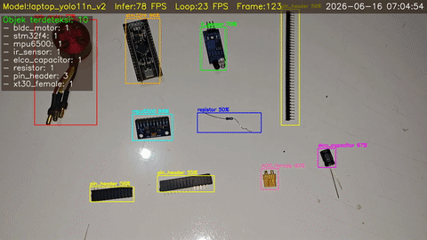 | 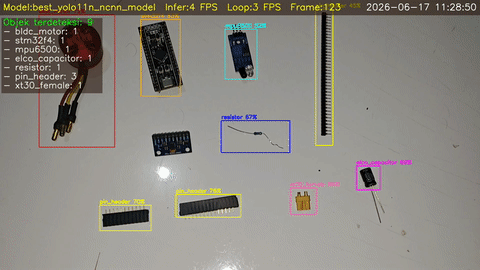 |
| **Camera stream** | 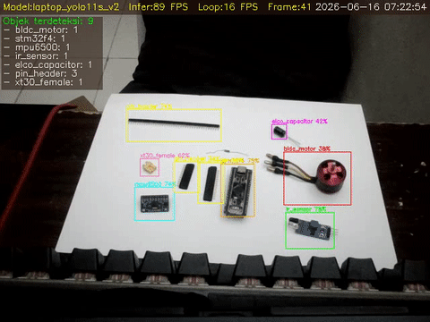 | 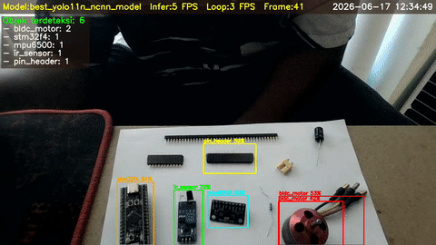 |

Full-resolution clips: [`videos/`](videos/) · raw logs: [`logs/`](logs/) and [`logs_pi/`](logs_pi/).

---

## 🧩 Classes
| id | class | id | class |
|----|-------|----|-------|
| 0 | `bldc_motor` | 4 | `elco_capacitor` |
| 1 | `stm32f4` | 5 | `resistor` |
| 2 | `mpu6500` | 6 | `pin_header` |
| 3 | `ir_sensor` | 7 | `xt30_female` |

---

## 📊 Results

### Training (RTX 3060, 120 epochs, imgsz 640)
| Model | mAP50 | mAP50-95 | Precision | Recall | Train time |
|-------|------:|---------:|----------:|-------:|-----------:|
| **YOLO11n** | 0.967 | 0.703 | 0.923 | 0.929 | 5.2 min |
| **YOLO11s** | 0.983 | 0.716 | 0.944 | 0.960 | 7.9 min |

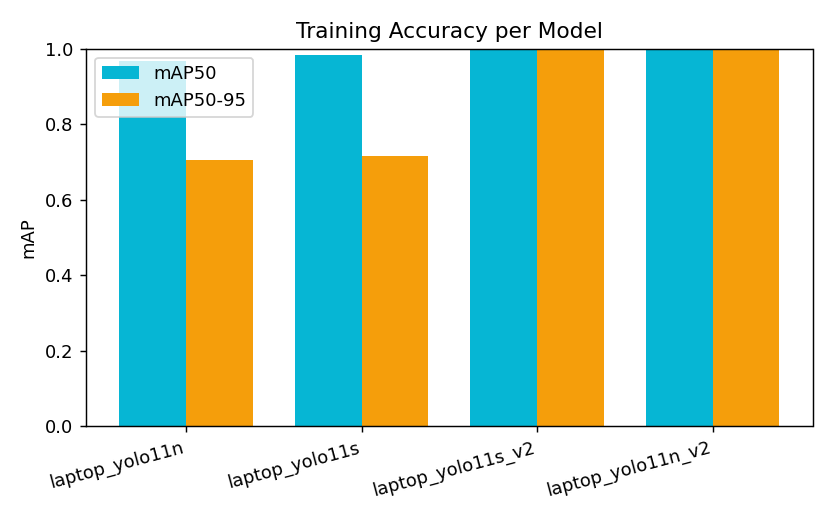
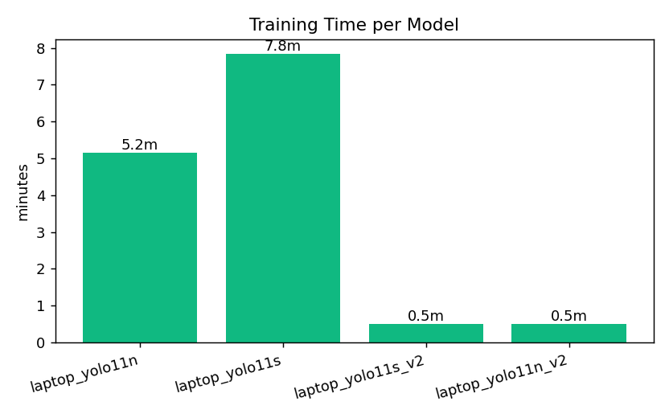

### Speed — Laptop vs Raspberry Pi (measured)
| Model | Device | Source | Infer FPS | Loop FPS |
|-------|--------|--------|----------:|---------:|
| YOLO11n | Laptop RTX 3060 | webcam | **86** | 31 |
| YOLO11n | Laptop RTX 3060 | video | 70 | 21 |
| YOLO11s | Laptop RTX 3060 | video | 72 | 22 |
| YOLO11n `.pt` | Raspberry Pi 4 (CPU) | video | 4.0 | 2.7 |
| **YOLO11n NCNN** | Raspberry Pi 4 (CPU) | video | **5.6** | 3.2 |
| **YOLO11n NCNN** | Raspberry Pi 4 (CPU) | stream | **5.9** | 3.8 |

> On the Pi, **NCNN is ~40% faster** than the plain `.pt` model. The laptop GPU is ~15× faster than the Pi CPU.

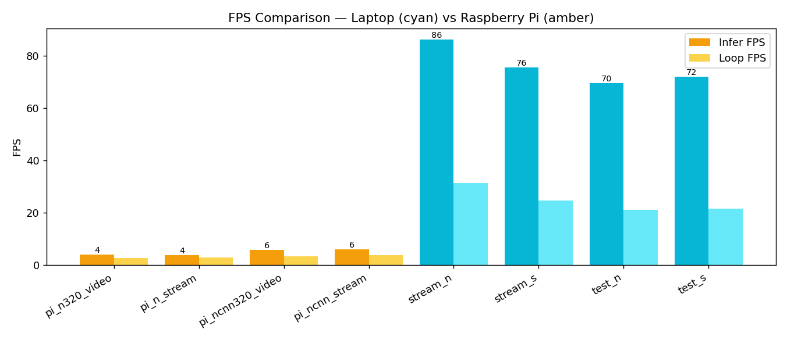
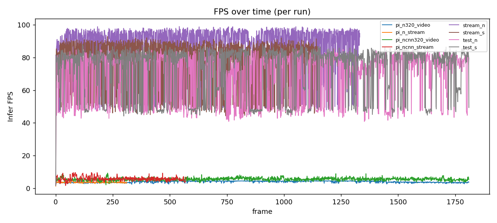

### Validation (best model)
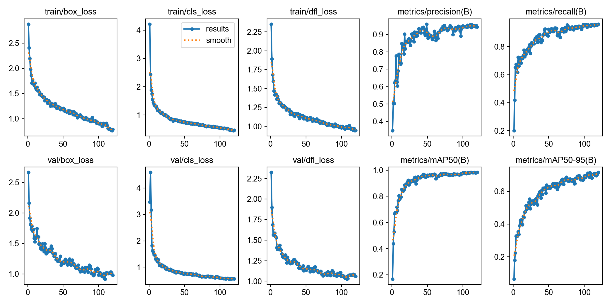
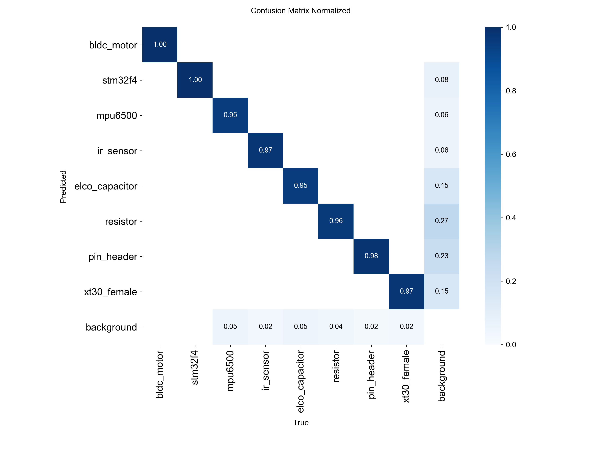
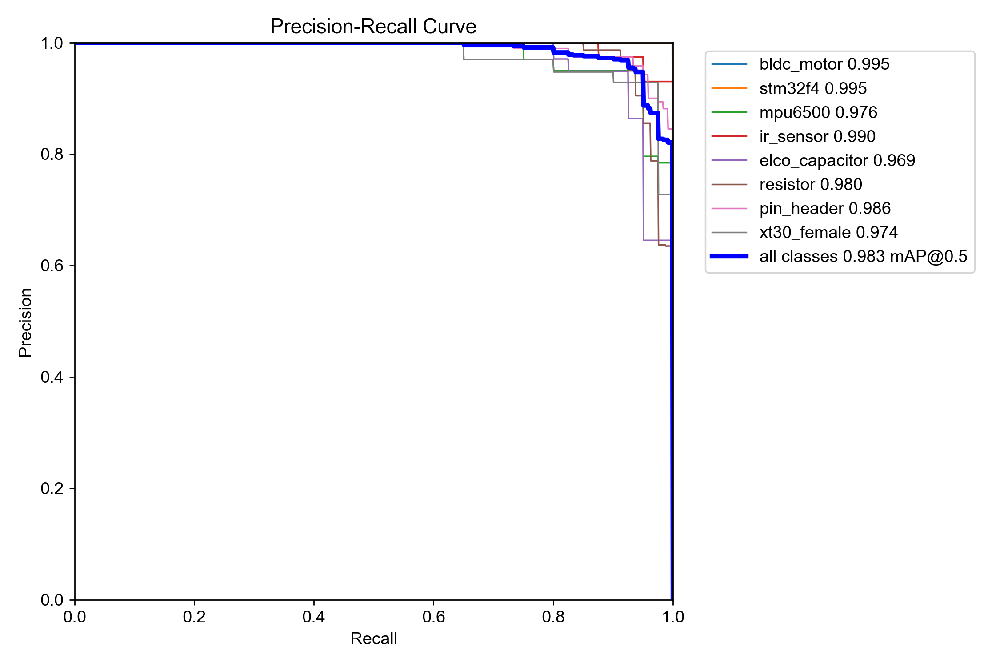

---

## 🛠️ Pipeline
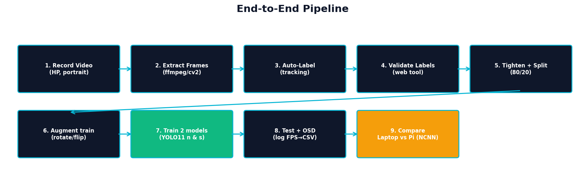

### 1 · Data capture
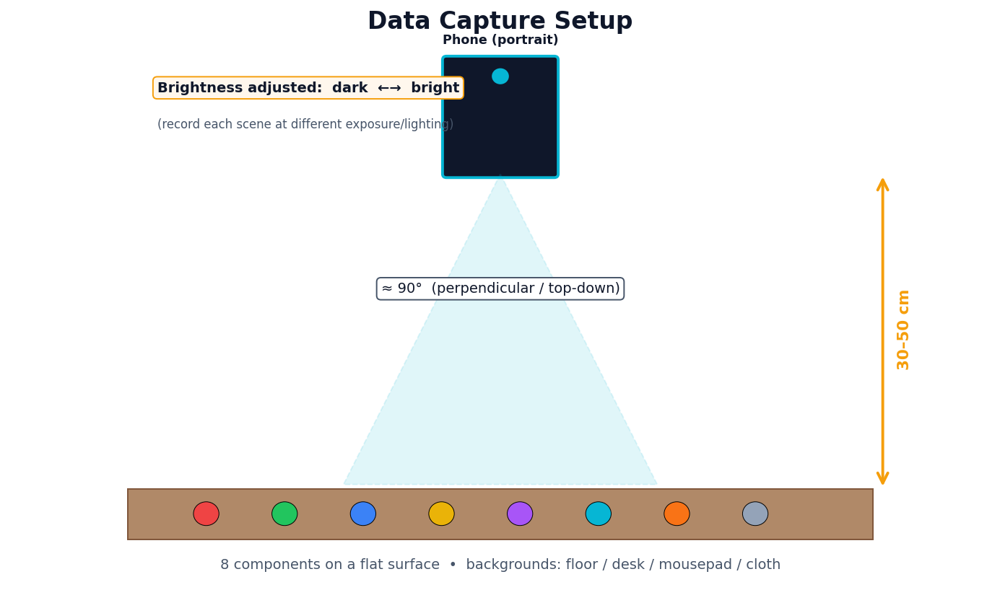

Phone in **portrait**, camera **top-down (≈90°)** at **30–50 cm**, components on a flat surface across **4 backgrounds** (floor / desk / mousepad / cloth), each filmed at **dark→bright** exposure for lighting variety.

### 2 · Extract frames
```bash
python tools/01_extract_frames.py --video data/video/clip.mp4 --out labeling/images --fps 5 --long 1280 --prefix v5
```
### 3 · Auto-label (model-assisted)
```bash
python tools/02_autolabel.py --model models/best_yolo11s.pt --images labeling/images --out labeling/labels --conf 0.25
```
### 4 · Validate in the browser (no install — pure stdlib)
```bash
python tools/label_web/server.py --images labeling/images --labels labeling/labels --classes labeling/classes.txt
# open http://localhost:8000  | A/D prev-next, 1-8 class, S save+validate, G copy to whole video
```
### 5 · Auto-tighten + split
```bash
python tools/tighten_boxes.py --images labeling/images --labels labeling/labels
python tools/04_split.py --src labeling --out dataset_yolo --seed 42
```
### 6 · Augment (train only)
```bash
python tools/03_augment.py --images dataset_yolo/train/images --labels dataset_yolo/train/labels --rot 90 180 270
```
### 7 · Train (auto-logged to CSV)
```bash
python tools/05_train.py --model yolo11n.pt --name laptop_yolo11n --epochs 120 --device 0
python tools/05_train.py --model yolo11s.pt --name laptop_yolo11s --epochs 120 --device 0
```
### 8 · Test + OSD + FPS log  →  9 · Graphs
```bash
python tools/06_detect_log.py --model models/best_yolo11s.pt --source test/test3.mp4 --tag laptop_11s_video --device 0 --save
python tools/07_make_graphs.py
```

---

## 🚀 Quickstart (anyone can try)
```bash
git clone https://github.com/AhmadHaniF1145/component-detection-yolo11.git
cd component-detection-yolo11
conda create -n yolo11-env python=3.12 -y && conda activate yolo11-env
pip install -r requirements.txt
# GPU (optional): pip install --upgrade torch torchvision torchaudio --index-url https://download.pytorch.org/whl/cu124

# detect on the bundled test video:
python tools/06_detect_log.py --model models/best_yolo11s.pt --source test/test3.mp4 --tag demo --save
# or your webcam:
python tools/06_detect_log.py --model models/best_yolo11s.pt --source usb0 --tag webcam --save
```

---

## 🍓 Raspberry Pi (reuse env, NCNN, 2 models)
```bash
# LAPTOP -> send to Pi:
scp -r models/best_yolo11n.pt tools test/test3.mp4 requirements-pi.txt <user>@<PI_IP>:~/component-detection/

# ON THE PI:
source ~/path/to/yolo-env/bin/activate     # reuse an existing env (has ultralytics+ncnn), or: pip install ultralytics
cd ~/component-detection
python3 tools/pi/export_ncnn.py --model best_yolo11n.pt --imgsz 320     # export the TRAINED model (not base yolo11n.pt!)
python3 tools/06_detect_log.py --model best_yolo11n_ncnn_model --source test3.mp4 --tag pi_ncnn_video --device cpu --imgsz 320 --save
python3 tools/06_detect_log.py --model best_yolo11n_ncnn_model --source http://<LAPTOP_IP>:8080/video --tag pi_ncnn_stream --device cpu --imgsz 320 --save
```
Live camera from the laptop to the Pi: on the laptop run `python tools/stream_cam.py --cam 0` (find IP with `ipconfig`), then use that URL as `--source` on the Pi.
**Always use `--device cpu` on the Pi.** Results: `logs/fps_<tag>.csv` + `logs/rec_<tag>.mp4` → copy back to the laptop's `logs_pi/` & `hasil_pi/`, then `python tools/07_make_graphs.py`.

Full step-by-step (send/run/transfer both ways): **[docs/PANDUAN.md](docs/PANDUAN.md)**.

---

## 🗂️ Structure
```
assets/ (illustrations, graphs, demo GIFs) · videos/ (demo clips) · models/ (best_yolo11n/s + NCNN)
dataset_yolo/ (train/val) · labeling/ (source pool) · tools/ (all scripts) · logs/ logs_pi/ hasil_pi/
results/ (training plots) · docs/PANDUAN.md · data.yaml · requirements*.txt · LICENSE
```

## 📝 License
MIT. Built on [Ultralytics YOLO11](https://github.com/ultralytics/ultralytics).
